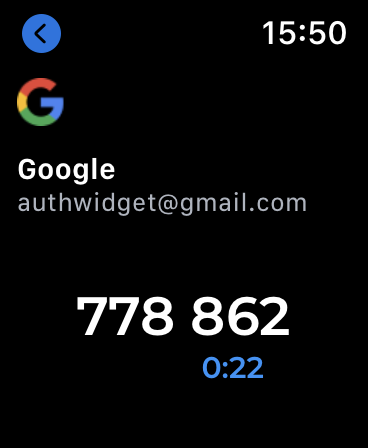

## **Use Authenticator on your Apple Watch**

### Set up Authenticator on your Apple Watch
Before you can start using Authenticator on your Apple Watch, you’ll need to get Authenticator on your iPhone. Then follow these steps:

1. Open Authenticator on your phone 
2. Tap Settings 
3. Enable Apple Watch 
4. Add at least 1 account 

